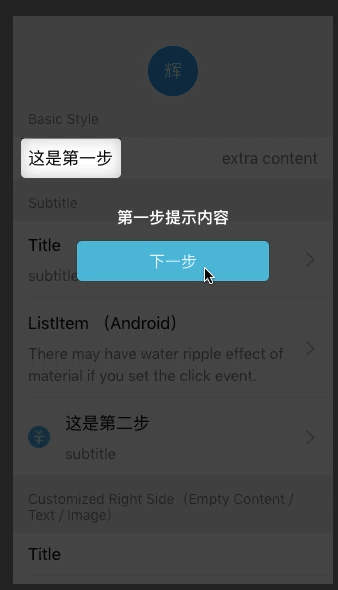

# kiner-guide
kiner-guide是一个基于react的操作指引组件，简单的配置，可以迅速集成至项目之中，显示友好的操作指引。本示例以Ant Design Mobile项目为例作为演示




### 主要文件列表

- App.js							                              调用示例
- src/components/KinerGuide.js               操作指引组件主文件
- src/components/KinerGuide.css            操作指引组件样式文件
- src/utils/inobounce.js                               为防止在ios中页面滚动导致一些问题引入此文件禁止页面回弹

### 以下为操作指引组件调用示例

App.js

```javascript
import React from 'react';
import {List} from 'antd-mobile';
import './App.css';

//step1. 引入操作指引组件
import KinerGuide from './components/KinerGuide/KinerGuide';

const Item = List.Item;
const Brief = Item.Brief;


class App extends React.Component {

    //step2. 定义操作指引信息对象
    guideList = [
        {position: 'bottom', text: "第一步提示内容", offset: 15},
        {position: 'top', text: "第二步提示内容", offset: 15},
        {position: 'auto', text: "第三步提示内容", offsetX: -15},
        {position: 'auto', text: "第四步提示内容", offsetX: -15},
        {position: 'auto', text: "第五步提示内容", offset: -15},
        {position: 'auto', text: "第六步提示内容", offsetX: -15},
        {position: 'auto', text: "第七步提示内容", offsetX: -15},
        {position: 'auto', text: "这是头像", offset: 15, type: 'circular'},
        {position: 'auto', text: "最后一步提示内容", offsetX: -15}
    ];

    constructor(props) {
        super(props);
        //step3. 初始化操作变量
        this.state = {
            disabled: false,//忽略，与本组件无关
            isShowGuide: false,//是否显示操作指引，通过控制此开关便可显示和隐藏操作指引
            guideStep: 0//当前操作指引的步骤
        };
    }

    componentDidMount() {
        //step4. 在页面准备完毕时显示操作指引
        this.setState({
            isShowGuide: true//当页面加载成功或者是如果操作指引依赖于某些异步操作，如axios请求等，则可在请求成功之后让操作指引显示
        });
    }


    render() {

        return (
            //step5. 为页面根元素增加ref,以便操作指引组件获取该对象进行操作
            <div className='container' ref='guideBox'>
                <div className="avator-box" style={{width: 'fit-content'}} ref='guideTarget7'>
                    <div className="avator">辉</div>
                </div>
                <List renderHeader={() => 'Basic Style'} className="my-list">

                    <Item extra={'extra content'}>
                        {/*step6. 为需要添加操作指引的元素添加ref,以便操作指引插件获取该对象进行操作，如果有多个步骤，一个页面可以添加多个，如guideTarget0,guideTarget1,guideTarget2等*/}
                        <div ref='guideTarget0' style={{width: 'fit-content'}}>
                            这是第一步
                        </div>
                    </Item>
                </List>
                <List renderHeader={() => 'Subtitle'} className="my-list">
                    <Item arrow="horizontal" multipleLine onClick={() => {
                    }}>
                        Title <Brief>subtitle</Brief>
                    </Item>

                    <Item
                        arrow="horizontal"
                        multipleLine
                        onClick={() => {
                        }}
                        platform="android"
                    >
                        ListItem （Android）<Brief>There may have water ripple effect of <br/> material if you set the
                        click
                        event.</Brief>
                    </Item>

                    <Item
                        arrow="horizontal"
                        thumb="https://zos.alipayobjects.com/rmsportal/dNuvNrtqUztHCwM.png"
                        multipleLine
                        onClick={() => {
                        }}
                    >

                        <div ref='guideTarget1' style={{width: 'fit-content'}}>
                            这是第二步 <Brief>subtitle</Brief>
                        </div>

                    </Item>
                </List>

                <List renderHeader={() => 'Customized Right Side（Empty Content / Text / Image）'} className="my-list">
                    <Item>Title</Item>
                    <Item arrow="horizontal" onClick={() => {
                    }}>Title</Item>
                    <Item extra="extra content" arrow="horizontal" onClick={() => {
                    }}>Title</Item>
                    <div ref='guideTarget2' style={{width: '100%'}}>
                        <Item extra="10:30" align="top"
                              thumb="https://zos.alipayobjects.com/rmsportal/dNuvNrtqUztHCwM.png"
                              multipleLine>
                            这是第三步 <Brief>的点点滴滴</Brief>
                        </Item>
                    </div>

                </List>
                <div ref='guideTarget6' style={{width: '100%'}}>

                    <List renderHeader={() => 'Align Vertical Center'} className="my-list">
                        <Item multipleLine extra="extra content">
                            第七步 <Brief>subtitle</Brief>
                        </Item>
                    </List>
                </div>
                <List renderHeader={() => 'Icon in the left'}>
                    <Item
                        thumb="https://zos.alipayobjects.com/rmsportal/dNuvNrtqUztHCwM.png"
                        arrow="horizontal"
                        onClick={() => {
                        }}
                    >My wallet</Item>
                    <div ref='guideTarget5' style={{width: '100%'}}>
                        <Item
                            thumb="https://zos.alipayobjects.com/rmsportal/UmbJMbWOejVOpxe.png"
                            onClick={() => {
                            }}
                            arrow="horizontal"
                        >
                            第六步
                        </Item>
                    </div>
                </List>
                <List renderHeader={() => 'Text Wrapping'} className="my-list">
                    <div ref='guideTarget3' style={{width: '100%'}}>
                        <Item data-seed="logId">这是第四步</Item>
                    </div>
                    <div ref='guideTarget8' style={{width: '100%'}}>
                        <Item wrap>第八步：Multiple line，long text will wrap；Long Text Long Text Long Text Long Text Long
                            Text
                            Long
                            Text</Item>

                    </div>
                    <Item extra="extra content" multipleLine align="top" wrap>
                        Multiple line and long text will wrap. Long Text Long Text Long Text
                    </Item>
                    <Item extra="no arrow" arrow="empty" className="spe" wrap>
                        In rare cases, the text of right side will wrap in the single line with long text. long text
                        long
                        text long text
                    </Item>


                </List>
                <List renderHeader={() => 'Other'} className="my-list">
                    <div ref='guideTarget4' style={{width: '100%'}}>
                        <Item disabled={this.state.disabled} extra="" onClick={() => {
                            console.log('click', this.state.disabled);
                            this.setState({disabled: true});
                        }}>第五步</Item>
                        <Item>
                            <select defaultValue="1">
                                <option value="1">Html select element</option>
                                <option value="2" disabled>Unable to select</option>
                                <option value="3">option 3</option>
                            </select>
                        </Item>
                    </div>

                </List>


                {/*step7. 页面中使用KinerGuide组件，传入相关配置进行配置组件*/}

                {/*visible：         是否显示显示操作指引*/}
                {/*guideBox：        页面容器对象，即step5中指定的元素*/}
                {/*target：          操作指引目标元素，即step6中指定的元素*/}
                {/*type：            操作指引弹框的类型，可选择 方形：square，圆形：circular*/}
                {/*offset：          操作指引框偏移量，优先级高于offsetX和offsetY*/}
                {/*offsetX：         水平偏移量*/}
                {/*offsetY：         垂直偏移量*/}
                {/*guidePosition：   操作提示面板的位置，可选择：自动：auto 操作指引框上方：top 操作指引框下方：bottom*/}
                <KinerGuide
                    visible={this.state.isShowGuide}
                    guideBox={this.refs.guideBox}
                    target={this.refs[`guideTarget${this.state.guideStep}`]}
                    type={this.guideList[this.state.guideStep].type}
                    offset={this.guideList[this.state.guideStep].offset}
                    offsetX={this.guideList[this.state.guideStep].offsetX}
                    offsetY={this.guideList[this.state.guideStep].offsetY}
                    guidePosition={this.guideList[this.state.guideStep].position}
                >
                    {/*操作指引提示框框，可在此处自定义添加代码实现业务逻辑*/}
                    <div className="guide-container">
                        <h1 className="title">{this.guideList[this.state.guideStep].text}</h1>
                        <div className="btn" onClick={e => {
                            if (this.state.guideStep !== this.guideList.length - 1) {
                                let {guideStep} = this.state;
                                this.setState({
                                    guideStep: ++guideStep
                                });
                            } else {
                                this.setState({
                                    isShowGuide: false
                                });
                            }

                        }}>{this.state.guideStep !== this.guideList.length - 1 ? '下一步' : '知道了'}</div>
                    </div>
                </KinerGuide>
            </div>
        );
    }
}

export default App;

```

操作指引组件KinerGuide.js

```javascript
import React from 'react';
import iNoBounce from '../../utils/inobounce';

import './KinerGuide.css'

class KinerGuide extends React.Component {
    constructor(props) {
        super(props);
        this.state = {
            bodyStyle: document.body.style,//用于临时存放body的样式
            visible: this.props.visible,//是否显示操作指引
            offset: this.props.offset === undefined ? 15 : this.props.offset//有些时候，我们的指引框可能需要比目标区块稍微大一点，指定此偏移量，便可以调整指引框大小
        };
    }

    pageScroll(nextProps) {
        let {
            visible,//是否显示操作指引
            target,//需显示操作指引的目标元素
            guideBox,//页面容器，可对当前页面容器进行位移以便完全显示操作指引
        } = nextProps;

        if (visible && target) {

            //当显示操作指引时将body高度设置为100%并超出隐藏，防止页面滚动
            document.body.style.height = '100%';
            document.body.style.overflow = 'hidden';

            if (guideBox) {
                //多步骤操作指引切换时可能会出现断站的位移，用户体验不佳，故在下一次操作指引开始前先将容器透明度置为0，当切换至下一步骤后再显示
                guideBox.style.opacity = 0;
                //重置页面位置，以便重新计算
                guideBox.style.transform = `translate3d(0,0,0)`;
            }

            //获取带指引区块的react信息，用于定位显示操作指引
            let react = target.getBoundingClientRect();
            //浏览器窗口的一半
            let halfHeightOfWindow = window.innerHeight / 2;
            //目标区块中心点y坐标
            let centerPointYOfTarget = react.top + react.height / 2;

            //当目标区块中心点y坐标大于当前浏览器窗口一半时，需对页面进行位移操作，一遍操作指引能够完全展示
            if (centerPointYOfTarget > halfHeightOfWindow) {
                setTimeout(() => {

                    let y = -Math.abs(halfHeightOfWindow - centerPointYOfTarget);


                    //当元素位移超过页面底部时，固定位移量为页面底部的位移量
                    if (Math.abs(y) >= document.documentElement.offsetHeight - window.innerHeight) {
                        y = -Math.abs(window.innerHeight - react.bottom);
                    }
                    //对页面融进进行位移，并使其透明度变为1使其显示
                    if (guideBox) {
                        guideBox.style.transform = `translate3d(0,${y}px,0)`;
                        guideBox.style.opacity = 1;
                    }

                }, 0);

            } else {
                //若带指引元素无需位移，则直接显示
                if (guideBox) {
                    guideBox.style.opacity = 1;
                }

            }

        } else {
            //若操作指引框无需显示，则重置样式
            document.body.style = this.state.bodyStyle;
            if (guideBox) {
                guideBox.style.transform = `translate3d(0,0,0)`;
                guideBox.style.opacity = 1;
            }
        }
    }

    componentWillReceiveProps(nextProps) {


        let {
            visible,//是否显示操作指引
            offset,//有些时候，我们的指引框可能需要比目标区块稍微大一点，指定此偏移量，便可以调整指引框大小,该属性优先级高于offsetX和offsetY,若指定了offset,则offsetX和offsetY失效
        } = nextProps;
        this.pageScroll(nextProps);

        this.setState({
            visible: visible,
            offset: offset === undefined ? 15 : offset
        });

    }

    componentDidMount() {
        this.pageScroll(this.props);
    }

    render() {
        let {
            target, //需显示操作指引的目标元素
            offset,//有些时候，我们的指引框可能需要比目标区块稍微大一点，指定此偏移量，便可以调整指引框大小,该属性优先级高于offsetX和offsetY,若指定了offset,则offsetX和offsetY失效
            offsetX = 0,//水平偏移量
            offsetY = 0,//垂直偏移量
            guidePosition = 'auto', //指引文案位于目标区块上方还是下方，若为上方则传入'top',若为下方则为'bottom'，若传入'auto',则自动判断指引区块位置，默认为'auto'
            type = 'square'//指引框类型，可选项包括'square'，'circular'，默认为方形'square'，可选择圆形'circular'
        } = this.props;
        let {
            offsetWidth, //页面宽度
            offsetHeight //页面高度
        } = document.documentElement;


        let react;
        if (target && this.state.visible) {
            //在ios中，由于页面回弹和滚动，会导致一些奇怪的显示问题，故采用iNoBounce禁止页面回弹和滚动
            iNoBounce.enable();
            //获取目标元素的react对象
            react = target.getBoundingClientRect();

            //渲染页面指引
            let width = 0, height = 0, borderTop = 0, borderRight = 0, borderBottom = 0, borderLeft = 0, left = 0,
                top = 0;

            if (offset !== undefined) {
                width = react.width + offset;
                height = react.height + offset;

                borderTop = react.top;
                borderLeft = react.left;
                borderRight = offsetWidth - borderLeft - react.width;
                borderBottom = offsetHeight - borderTop - react.height;

                if (offset < 0) {
                    borderLeft += Math.abs(offset);
                    borderRight += Math.abs(offset);
                    borderTop += Math.abs(offset);
                    borderBottom += Math.abs(offset);
                }

                left = react.left - offset / 2 - borderLeft;
                top = react.top - offset / 2 - borderTop;
            } else {


                borderTop = react.top;
                borderLeft = react.left;

                borderRight = offsetWidth - borderLeft - react.width;
                borderBottom = offsetHeight - borderTop - react.height;


                //offsetX
                width = react.width + offsetX;


                if (offsetX < 0) {
                    borderLeft += Math.abs(offsetX);
                    borderRight += Math.abs(offsetX);
                }

                left = react.left - offsetX / 2 - borderLeft;

                //offsetY

                height = react.height + offsetY;

                if (offsetY < 0) {
                    borderTop += Math.abs(offsetY);
                    borderBottom += Math.abs(offsetY);
                }

                top = react.top - offsetY / 2 - borderTop;


            }

            if (guidePosition === 'auto') {

                if (react.top + react.height / 2 > window.innerHeight / 2) {
                    guidePosition = 'top';
                } else {
                    guidePosition = 'bottom';
                }

            }


            return (<div className="guideModal-container" ref='guideContainer'
                         style={{width: document.documentElement.offsetWidth}}>
                <div className="mask" style={{
                    width: width,
                    height: height,
                    left: left,
                    top: top,
                    borderWidth: `${borderTop}px ${borderRight}px ${borderBottom}px ${borderLeft}px`
                }}>
                    <div className={`target ${type}`}>
                    </div>
                </div>
                <div className="guide-content" style={{
                    left: 0,
                    top: `${guidePosition === 'top' ? react.top - (offset === undefined ? offsetY : offset) / 2 : react.bottom + (offset === undefined ? offsetY : offset) / 2}px`,
                    transform: `${guidePosition === 'top' ? 'translate3d(0,-100%,0)' : 'translate3d(0,0,0)'}`
                }}>
                    {this.props.children}
                </div>
            </div>);
        } else {
            //隐藏操作指引框时恢复页面滚动状态
            iNoBounce.disable();
            return <div></div>
        }
    }
}

export default KinerGuide;
```

操作指引配套样式KinerGuide.css

```css
.guideModal-container {
    position: absolute;
    left: 0;
    top: 0;
    width: 100%;
    height: 100%;
    transform: translate3d(0, 0, 0);
    overflow: hidden;
    -webkit-overflow-scrolling: touch;
    z-index: 999999999;
}
.guideModal-container .mask {
    position: absolute;
    border: 0 solid rgba(0, 0, 0, 0.7);
    transition: all .3s;
    z-index: 999999;
    pointer-events: none;
    overflow: hidden;
}
.guideModal-container .mask .target {
    position: relative;
    height: 100%;
    width: 100%;
    border-radius: 5px;
    outline: 7px solid rgba(0, 0, 0, 0.7);
    box-shadow: 0 0 0 7px rgba(0, 0, 0, 0.7), inset 0 0 15px #ccc;
    background-color: transparent;
}
.guideModal-container .mask .target.circular{
    border-radius: 50%;
    box-shadow: 0 0 0 15px rgba(0, 0, 0, 0.7), inset 0 0 15px #ccc;
}
.guideModal-container .guide-content {
    position: fixed;
    z-index: 9999999;
    width: 100%;
    color: #FFFFFF;
}
```

防止ios中页面滚动回弹的工具inobounce.js

```javascript
/*! iNoBounce - v0.2.0
* https://github.com/lazd/iNoBounce/
* Copyright (c) 2013 Larry Davis <lazdnet@gmail.com>; Licensed BSD */
(function(global) {
    // Stores the Y position where the touch started
    var startY = 0;

    // Store enabled status
    var enabled = false;

    var supportsPassiveOption = false;
    try {
        var opts = Object.defineProperty({}, 'passive', {
            get: function() {
                supportsPassiveOption = true;
            }
        });
        window.addEventListener('test', null, opts);
    } catch (e) {}

    var handleTouchmove = function(evt) {
        // Get the element that was scrolled upon
        var el = evt.target;

        // Allow zooming
        var zoom = window.innerWidth / window.document.documentElement.clientWidth;
        if (evt.touches.length > 1 || zoom !== 1) {
            return;
        }

        // Check all parent elements for scrollability
        while (el !== document.body && el !== document) {
            // Get some style properties
            var style = window.getComputedStyle(el);

            if (!style) {
                // If we've encountered an element we can't compute the style for, get out
                break;
            }

            // Ignore range input element
            if (el.nodeName === 'INPUT' && el.getAttribute('type') === 'range') {
                return;
            }

            var scrolling = style.getPropertyValue('-webkit-overflow-scrolling');
            var overflowY = style.getPropertyValue('overflow-y');
            var height = parseInt(style.getPropertyValue('height'), 10);

            // Determine if the element should scroll
            var isScrollable = scrolling === 'touch' && (overflowY === 'auto' || overflowY === 'scroll');
            var canScroll = el.scrollHeight > el.offsetHeight;

            if (isScrollable && canScroll) {
                // Get the current Y position of the touch
                var curY = evt.touches ? evt.touches[0].screenY : evt.screenY;

                // Determine if the user is trying to scroll past the top or bottom
                // In this case, the window will bounce, so we have to prevent scrolling completely
                var isAtTop = (startY <= curY && el.scrollTop === 0);
                var isAtBottom = (startY >= curY && el.scrollHeight - el.scrollTop === height);

                // Stop a bounce bug when at the bottom or top of the scrollable element
                if (isAtTop || isAtBottom) {
                    evt.preventDefault();
                }

                // No need to continue up the DOM, we've done our job
                return;
            }

            // Test the next parent
            el = el.parentNode;
        }

        // Stop the bouncing -- no parents are scrollable
        evt.preventDefault();
    };

    var handleTouchstart = function(evt) {
        // Store the first Y position of the touch
        startY = evt.touches ? evt.touches[0].screenY : evt.screenY;
    };

    var enable = function() {
        // Listen to a couple key touch events
        window.addEventListener('touchstart', handleTouchstart, supportsPassiveOption ? { passive : false } : false);
        window.addEventListener('touchmove', handleTouchmove, supportsPassiveOption ? { passive : false } : false);
        enabled = true;
    };

    var disable = function() {
        // Stop listening
        window.removeEventListener('touchstart', handleTouchstart, false);
        window.removeEventListener('touchmove', handleTouchmove, false);
        enabled = false;
    };

    var isEnabled = function() {
        return enabled;
    };

    // Enable by default if the browser supports -webkit-overflow-scrolling
    // Test this by setting the property with JavaScript on an element that exists in the DOM
    // Then, see if the property is reflected in the computed style
    var testDiv = document.createElement('div');
    document.documentElement.appendChild(testDiv);
    testDiv.style.WebkitOverflowScrolling = 'touch';
    var scrollSupport = 'getComputedStyle' in window && window.getComputedStyle(testDiv)['-webkit-overflow-scrolling'] === 'touch';
    document.documentElement.removeChild(testDiv);

    if (scrollSupport) {
        enable();
    }

    // A module to support enabling/disabling iNoBounce
    var iNoBounce = {
        enable: enable,
        disable: disable,
        isEnabled: isEnabled
    };

    if (typeof module !== 'undefined' && module.exports) {
        // Node.js Support
        module.exports = iNoBounce;
    }
    if (typeof global.define === 'function') {
        // AMD Support
        (function(define) {
            define('iNoBounce', [], function() { return iNoBounce; });
        }(global.define));
    }
    else {
        // Browser support
        global.iNoBounce = iNoBounce;
    }
}(this));
```

